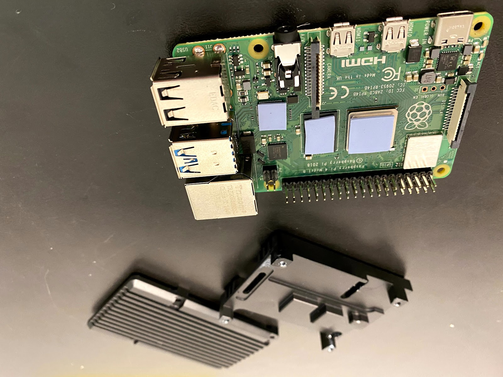
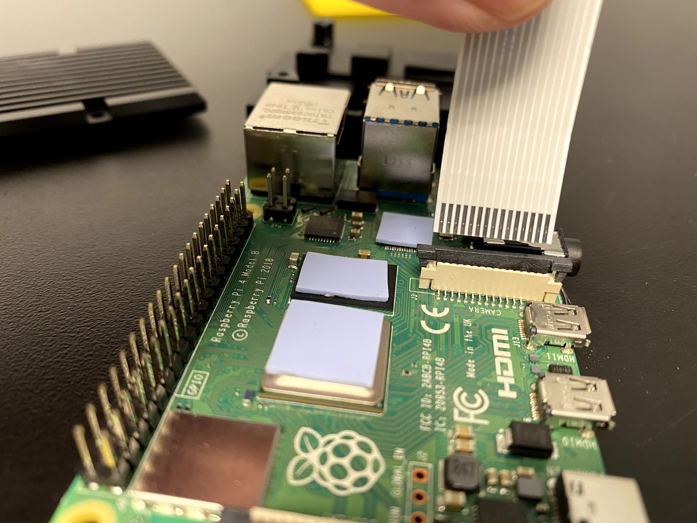
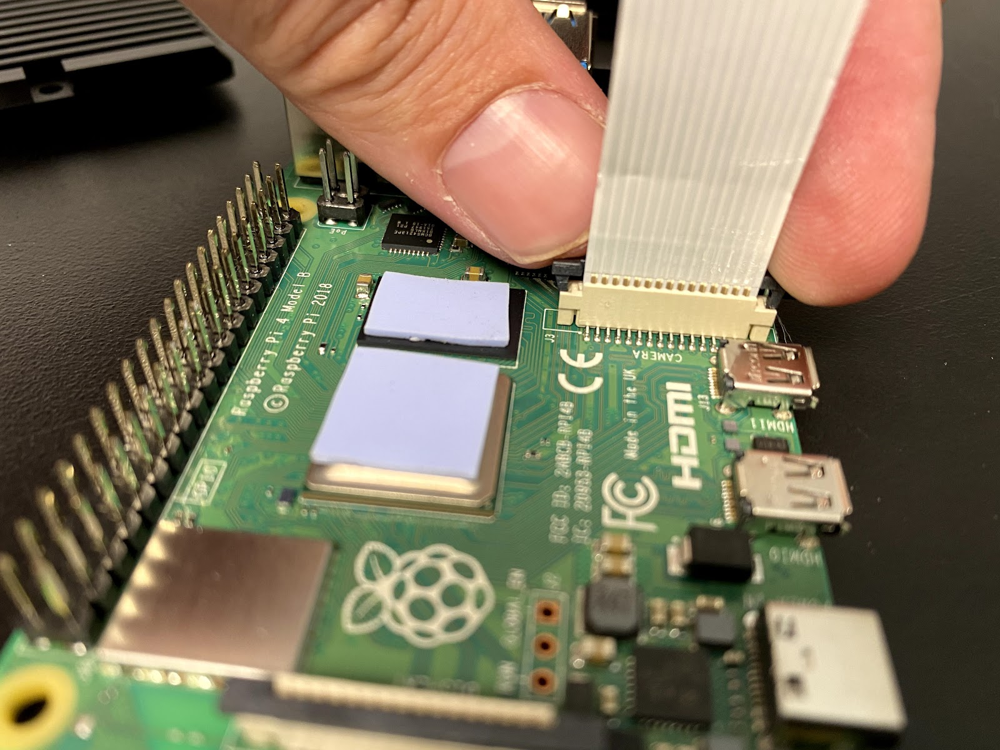
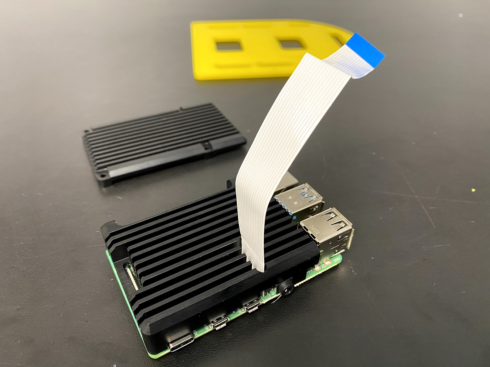
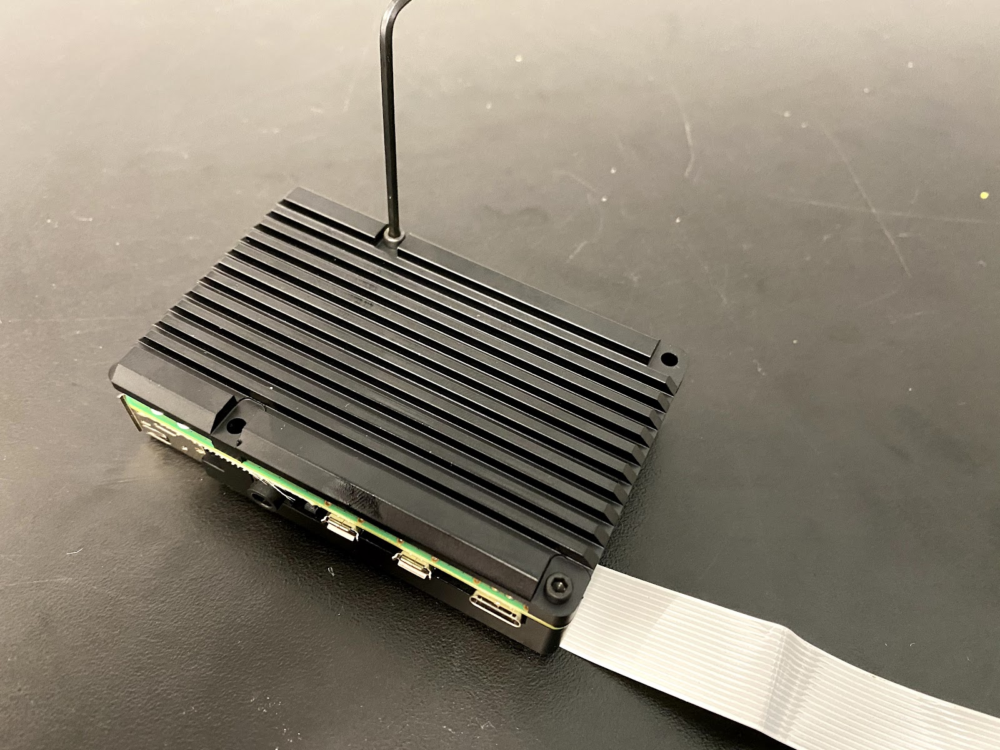

## MBot Assembly Guide

This guide will walk you through the steps needed to assemble the MBot Omni. The MBot Omni Bot is comprised of 3 sections i.e the bottom plate, middle plate and the top plate. Each of these plates are assembled separately first, before attaching them together to create the MBot Omni.

</img>

***

## Bottom Assembly

</img>

#### Required Components:
- 1 X Bottom Acrylic Plate
- 3 X 6V DC Motors with Encoders
- 3 X 3D Printed Motor Mounts
- 3 X Motor Cables
- 1 X Robotics Control Board
- 4 X 2.5M - 8mm Nylon Standoffs
- 3 X Omni-wheel Sets
- 4 X 1.5in Aluminum 4-40 Standoffs

#### Assembly Steps
1. Insert the Motors into the 3D Printed Motor Mounts with the Encoder header pins facing left or right. 

2.  Align the motor holes with the holes of the Motor Mount. Attach the Motor with the Mount using two 2.5M X 8mm screws.

3. Repeat Steps 1 & 2 to for the remain 2 Motors & Motor Mounts.

4. Note the forward direction of the bottom the plate as show here.

5. Attach the first Motor Mount to the bottom plate facing in the backward direction. Using 4 2.5M X 8mm screws secure the Motor Mount to the plate.

6. Repeat this step by attaching the Left & Right Motor Mounts. 

7. Flip the plate over and attach four 2.5M - 8mm Nylon Standoffs in the holes shown below. Using 2.5M X 6mm screws attach the standoffs to the board. Note there are 4 additional holes in the plate that are meant for a newer version of the Robotics Control Board. Ensure you are have the correct version of the Robotics Control Board.

8. Secure the Robotics Control Board to the Nylon Standoffs using four 2.5M - 6 mm screws. Ensure that the Motor header pins are facing the forward direction of the plate. 

9. Flip the plate over and connect each of the Motors with a cable. Ensure that when connecting the cables that the Green wire (of the cable) is connected to the Ground (GND) pin on the encoder of the motors. Note that the order of the wires of ends of the motor cables are different. If you are not able to connect the Green wire to GND, you may have to use the other end of the cable. 

10. After connecting all 3 motor cables, fish the cable through the opening in the middle of the bottom plate and under the Robotics Control Board. Pull the cable so that they all point toward the forward direction of the plate.

11. Now we are going to connect the motor cables to the Robotics Control Board. Note that the Male Headers on the Robotics Control Board are numbered M0, M1 & M2. The back Motor will be connected to M1. The right motor will be connected to M0 and the left motor will be connected to M2.

12. Ensure that when connecting the motor cables that the Green wire (of the cable) is connected to the Ground (GND) pin on Robotics Control Board. Connect all 3 motors to the Robotics Control Board. 

13. Next attach the Omniwheel sets to the shaft of each motor. Place the Omniwheels on the motor shaft, with the Onmiwheel hubs facing the motors. Ensure to leave a gap between the hub and the motors so that wheels can spin easily without hitting the screws on the motors. Using a M4 allen key tighten both screws on the Omniwheel hubs. 

14. Once all the wheels are secured, attach four 1.5in aluminum standoffs using 4-40 screws in the holes shown below. 

***

## Middle Assembly

#### Required Components:
- 1 X Middle Acrylic Plate
- 1 X Raspberry Pi 4B 4GB 
- 1 X Raspberry Pi Heatsink Case
- 1 X Raspberry Pi 5MP Camera with Cable
- 1 X 3D Printed Camera Mount
- 4 X 1.5in Aluminum 4-40 Standoffs

#### Assembly Steps

1. Carefully peel off the protective plastic on both sides of the thermal pads that come packaged with the heatsink case.  Stick them onto the three chips shown on the Raspberry Pi, or directly onto the heatsink.  There are 3 spots for the thermal pads and the thermal pads are precut to the required shape.

      

2. Insert the camera data cable that comes packaged with the camera into the RPi’s camera connector.  You will pull up the black plastic clamping piece, and slide the cable in with the metal contacts pointing away from the black plastic clamping piece.  Ensure it is properly seated and push down on the black plastic clamping piece to keep in place.  You should just barely see the contacts above the top of the connector.

3. Thread the camera data cable through the corresponding slot on the heatsink case top.

4. Screw the bottom of the heatsink case onto the RPi with two of the included M2.5 socket cap screws through holes on two opposite corners of the case.  We will screw longer screws into the other two holes to mount the case to the middle plate.

