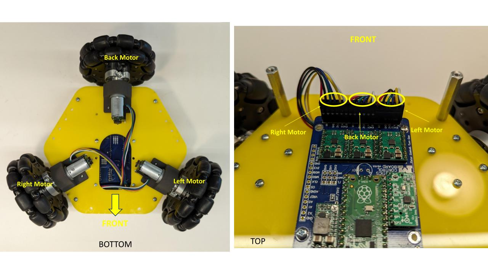
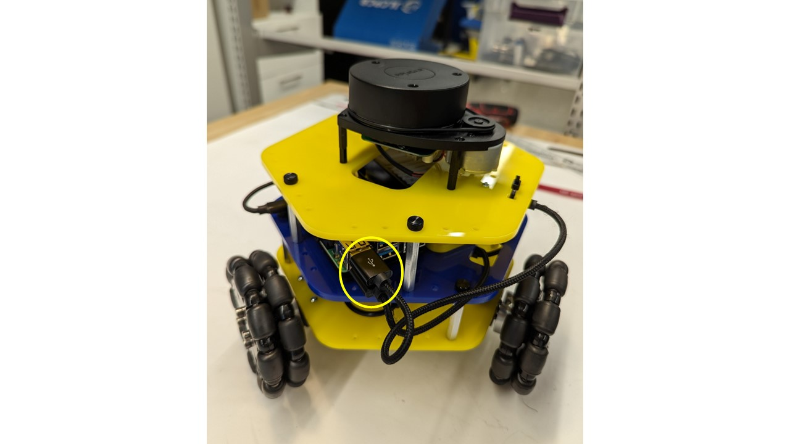

<header class="main project">
    <strong>Tutorial:</strong> MBot Assembly
</header>

<!--  -->
This guide will walk you through the steps needed to assemble the MBot Omni. The MBot Omni Bot is comprised of 3 sections i.e the [bottom plate](#bottom), [middle plate](#middle) and the [top plate](#top). Each of these plates are assembled separately first, before attaching them together to create the MBot Omni.

***

## Bottom Assembly
{: .line}

#### Required Components:
- 1 X Bottom Acrylic Plate
- 3 X 6V DC Motors with Encoders
- 3 X 3D Printed Motor Mounts
- 3 X Motor Cables
- 1 X Robotics Control Board
- 4 X 2.5M-8mm Nylon Standoffs
- 3 X Omni-wheel Sets
- 4 X 1.5in Aluminum 4-40 Standoffs

#### Assembly Steps
1. Align unthreaded holes in motor vertically to the holes in the motor mount, with the motor connector on the left side of the mount (while facing motor shaft), and fasten two (2) M2.5x5 bolts to secure motor to mount. NOTE: connector GND pin should be at the top

    

2.  Connect motor harness to motor pins, ensuring the green wire is connected to the GND pin

    

3. Repeat Steps 1 & 2 to for the remaining 2 Motors & Motor Mounts.

4. Next we will assembly the Robotics Control Board.

    

5. Fasten four (4) M2.5x5 bolts through PCB mounting holes and into M2.5x8 nylon standoffs.

    

5. Insert either male end of the DC battery cable into PCB power receptacle, and micro-USB connector into PICO microcontroller.

    

6. We will now attach the motors and the Robotics Control Board to the bottom acrylic plate.

    

7. Fasten three (3) motor assemblies to the bottom-side of the yellow acrylic plate with four (4) M2.5x8 bolts each, threading into the heat-set inserts on the mounts. NOTE: the “front” or “forward” direction of the robot as shown.

    

8. Fasten the PCB assembly to the top-side of the yellow acrylic plate with four (4) M2.5x8 bolts, threading into the nylon standoffs attached to the PCB

    

9. Slide the three (3) Omni wheel assemblies onto the motor shafts, leaving a nominal gap between the couplers and the motor mount screw heads, and fasten by tightening the two hex-head bolts on the coupler.

    

10. Route the three (3) motor assembly harnesses through the cut-out in the acrylic plate, and connect to the pin-outs on the end of the PCB assembly. NOTE: each harness must be connected in the orientation shown: if looking at the PCB from the back of the robot, the red wires should be on the left, and white wires on the right.

    

11. Note that the Male Headers on the Robotics Control Board are numbered M0, M1 & M2. The back Motor will be connected to M1. The right motor will be connected to M0 and the left motor will be connected to M2.

    

12. Fasten four (4) #4-40x1.5” aluminum standoffs to the top-side of the yellow acrylic plate with four (4) #4-40x0.5” bolts.

    

***

## Middle Assembly
{: .line}

#### Required Components:
- 1 X Middle Acrylic Plate
- 1 X Raspberry Pi 4B 4GB
- 1 X Raspberry Pi Heatsink Case
- 1 X Raspberry Pi 5MP Camera with Cable
- 1 X 3D Printed Camera Mount
- 4 X 1.5in Aluminum 4-40 Standoffs

#### Assembly Steps

1. Carefully peel off the protective plastic on both sides of the thermal pads that come packaged with the heatsink case.  Stick them onto the three chips shown on the Raspberry Pi, or directly onto the heatsink.  There are 3 spots for the thermal pads and the thermal pads are precut to the required shape.

    

2. Insert the camera data cable that comes packaged with the camera into the RPi’s camera connector.  You will pull up the black plastic clamping piece, and slide the cable in with the metal contacts pointing away from the black plastic clamping piece.  Ensure it is properly seated and push down on the black plastic clamping piece to keep in place.  You should just barely see the contacts above the top of the connector.
    
    

3. Thread the camera data cable through the corresponding slot on the heatsink case top.
    

4. Screw the bottom of the heatsink case onto the RPi with two of the included M2.5 socket cap screws through holes on two opposite corners of the case.  We will screw longer screws into the other two holes to mount the case to the middle plate.

    

5. With the black piece of the connector pulled out on the camera, insert the Raspberry Pi ribbon cable into the camera PCB as shown (metal contacts facing toward the camera side, blue side on the rear), and then close the black connector.
    

6. Fasten the camera PCB to the 3D-printed camera mount with two (2) M2x8 bolts threading directly into the 3D-printed material (only 2 necessary, diagonal orientation preferred)
    

7. Insert USB-C-to-USB cable into port on Raspberry Pi as shown
    

8. Next we are going to attach the Raspberry Pi & the Camera to the middle acrylic plate.

    

9. Fasten Raspberry Pi/Camera assembly onto the top of the blue acrylic plate by threading two (2) M2.5x20 bolts from the bottom-side through to the corresponding holes on the Raspberry Pi case/heatsink.

    

10. Fasten the camera mount to the top of the acrylic plate as shown, with a single M2.5x8 bolt from the bottom-side.

    

11. Fasten four (4) #4-40x1.5” aluminum standoffs to the top-side of the blue acrylic plate with four (4) #4-40x0.5” bolts.

    

***

## Top Assembly
{: .line}

#### Required Components:
- 1 X Bottom Plate
- 1 X RPLidar A1 with USB Interface
- 1 X Zip tie
- 1 X Micro USB Cable

#### Top Assembly Steps

1. Fish the RPLidar USB Interface through the opening in the top plate and align with holes shown below.

    

2. Using two M2 screws and nuts, screw the USB interface on the bottom side of the top plate.
    

3. Place the RPLidar on top of the top plate and align with the holes as shown below.  Using four 2.5MX8 mm screw, secure the RPLidar to the top plate.

    

4. Attach a MircoUSB cable to the USB interface. Using a Zip tie secure the USB cable to the top plate.

    

***

<header class="major" id="final">
    <h3><a href="#final">Final Assembly</a></h3>
</header>

#### Required Components:
- 1 X Top Assembly
- 1 X Middle Assembly
- 1 X Bottom Assembly
- 8 X 4-40 Thumbscrews
- 1 X USB-C Cable
- 1 X Micro USB Cable
- 1X TalentCell Battery with Power Cable

#### Top Assembly Steps

1. With four (4) thumbscrews, fasten the middle blue acrylic plate to the standoffs of the bottom yellow acrylic plate after aligning the camera to the frontward orientation of the robot. NOTE: You may have to remove the USB-C connector to fasten the 4th thumbscrew, just remember to re-connect after fastened.

    

2. Sit the battery into its designated area with the on/off switch pointing toward the front of the robot, and connect the DC power connector from the bottom plate PCB and USB-C from the Raspberry Pi.

    

3. Connect the bottom plate USB cable to a USB port on the Raspberry Pi

    

4. With four (4) thumbscrews, fasten the top yellow acrylic plate assembly to the standoffs of the middle blue acrylic plate after aligning the LiDAR USB cable to the rearward orientation of the robot.

    

5. Connect the LiDAR USB cable from the top plate assembly to a port on the Raspberry Pi

    

6. The final assembly should appear as shown.

    